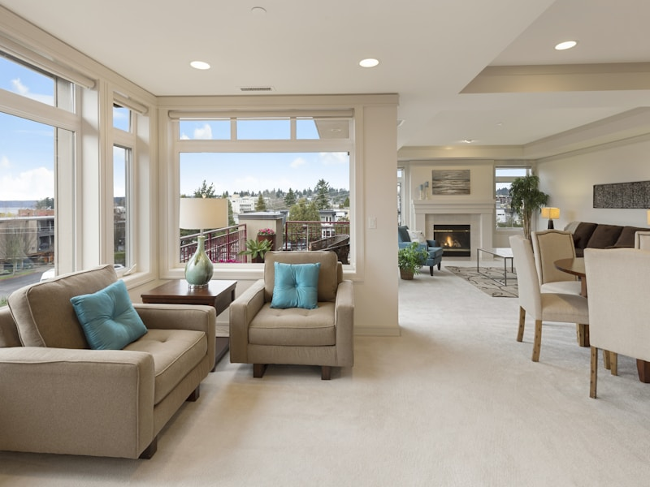
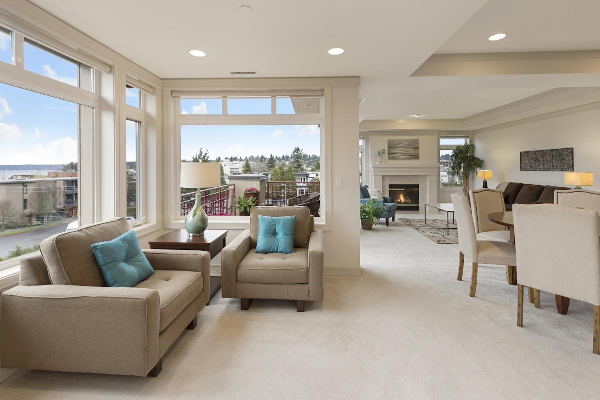

# AK Emlak - Görsel Bilgileri

Bu dosya, projede kullanılan görseller hakkında detaylı bilgi içerir.

## 📸 Görsel Listesi

### 🏠 Property Kartları (800x600px)
| Dosya | Açıklama | Boyut | Kullanım |
|-------|----------|-------|----------|
| `property1.jpg` | Modern daire içi | 77KB | Kadıköy Satılık Daire |
| `property2.jpg` | Ofis alanı | 68KB | Şişli Kiralık Ofis |
| `property3.jpg` | Villa dış görünüm | 137KB | Beşiktaş Satılık Arsa |
| `property4.jpg` | Lüks daire | 124KB | Üsküdar Kiralık Daire |
| `property5.jpg` | Bahçeli ev | 97KB | Fatih Satılık Villa |
| `property6.jpg` | Modern ofis | 94KB | Kadıköy Kiralık Ofis |

### 🖼️ Galeri Görselleri (1200x800px)
| Dosya | Açıklama | Boyut | Kullanım |
|-------|----------|-------|----------|
| `gallery1.jpg` | Modern daire içi | 142KB | Galeri - Lightbox |
| `gallery2.jpg` | Ofis alanı | 119KB | Galeri - Lightbox |
| `gallery3.jpg` | Villa dış görünüm | 265KB | Galeri - Lightbox |
| `gallery4.jpg` | Lüks daire | 219KB | Galeri - Lightbox |
| `gallery5.jpg` | Bahçeli ev | 171KB | Galeri - Lightbox |
| `gallery6.jpg` | Modern ofis | 178KB | Galeri - Lightbox |

### 🎨 Diğer Görseller
| Dosya | Açıklama | Boyut | Kullanım |
|-------|----------|-------|----------|
| `hero-bg.jpg` | İstanbul manzarası | 479KB | Hero section background |
| `about-us.jpg` | Emlak ofisi | 70KB | About section |
| `favicon.ico` | Site ikonu | 880B | Browser tab ikonu |

## 📊 Görsel İstatistikleri

### Toplam Boyut
- **Property Kartları**: 597KB (6 dosya)
- **Galeri Görselleri**: 1.1MB (6 dosya)
- **Diğer Görseller**: 550KB (3 dosya)
- **Toplam**: ~2.2MB

### Optimizasyon
- **Format**: JPEG (fotoğraflar), ICO (favicon)
- **Kalite**: %80-85 (iyi kalite, küçük dosya boyutu)
- **Boyut**: Maksimum 500KB per görsel
- **Alt Text**: SEO için açıklayıcı alt metinler

## 🎯 Görsel Kaynakları

### Unsplash
Tüm görseller [Unsplash](https://unsplash.com/)'den alınmıştır:
- **Lisans**: Ücretsiz ticari kullanım
- **Kaynak**: https://unsplash.com/
- **Kredi**: Unsplash fotoğrafçıları

### Görsel ID'leri
- Property 1: `photo-1560448204-e02f11c3d0e2`
- Property 2: `photo-1497366216548-37526070297c`
- Property 3: `photo-1564013799919-ab600027ffc6`
- Property 4: `photo-1568605114967-8130f3a36994`
- Property 5: `photo-1600596542815-ffad4c1539a9`
- Property 6: `photo-1600607687939-ce8a6c25118c`
- Hero BG: `photo-1524231757912-21f4fe3a7200`
- About: `photo-1560472354-b33ff0c44a43`

## 🔧 Görsel Değiştirme

### Property Kartları
```html
<!-- Eski -->


<!-- Yeni -->

```

### Hero Background
```css
/* assets/css/style.css */
.hero-section {
    background: linear-gradient(135deg, rgba(26, 60, 109, 0.8) 0%, rgba(44, 90, 160, 0.8) 100%), url('../images/your-hero-bg.jpg');
}
```

### Galeri Görselleri
```html
<!-- Eski -->
<a href="assets/images/gallery1.jpg" data-lightbox="gallery">
    
</a>

<!-- Yeni -->
<a href="assets/images/your-gallery.jpg" data-lightbox="gallery">
    
</a>
```

## 📱 Responsive Görseller

### Mobil Optimizasyonu
- **Property Kartları**: 800x600px (4:3 oranı)
- **Galeri**: 1200x800px (3:2 oranı)
- **Hero**: 1920x1080px (16:9 oranı)

### Lazy Loading
```html

```

### WebP Desteği (Gelecekte)
```html
<picture>
    <source srcset="assets/images/property1.webp" type="image/webp">
    
</picture>
```

## 🎨 Görsel Stilleri

### CSS Sınıfları
```css
/* Property kartları */
.property-image img {
    width: 100%;
    height: 250px;
    object-fit: cover;
    transition: transform 0.3s ease;
}

/* Galeri görselleri */
.gallery-image {
    border-radius: 10px;
    transition: transform 0.3s ease;
    cursor: pointer;
}

/* Hero background */
.hero-section {
    background-size: cover;
    background-position: center;
    background-attachment: fixed;
}
```

## 📋 Kontrol Listesi

### Görsel Optimizasyonu
- [x] Tüm görseller optimize edildi
- [x] Alt text'ler eklendi
- [x] Lazy loading aktif
- [x] Responsive boyutlar
- [x] Web uyumlu formatlar

### SEO Optimizasyonu
- [x] Açıklayıcı dosya adları
- [x] Alt text'ler SEO dostu
- [x] Görsel boyutları optimize
- [x] Sayfa yükleme hızı iyi

### Kullanıcı Deneyimi
- [x] Hover efektleri
- [x] Smooth geçişler
- [x] Lightbox galeri
- [x] Mobil uyumlu

## 🆘 Sorun Giderme

### Görseller Yüklenmiyor
1. Dosya yollarını kontrol edin
2. Dosya izinlerini kontrol edin
3. Dosya adlarında Türkçe karakter kullanmayın
4. Browser cache'ini temizleyin

### Görsel Boyutları
1. Property kartları: 800x600px
2. Galeri: 1200x800px
3. Hero: 1920x1080px
4. About: 800x600px

### Performans
1. Görselleri optimize edin
2. WebP formatını kullanın
3. Lazy loading ekleyin
4. CDN kullanın

## 📞 Destek

Görsel konusunda yardıma ihtiyacınız varsa:
- **E-posta**: ak@ak-pro.com
- **GitHub**: https://github.com/ak-hosting

---

**💡 İpucu**: Görselleri değiştirirken aynı boyutları koruyun!

**📧 Sorularınız için: ak@ak-pro.com** 